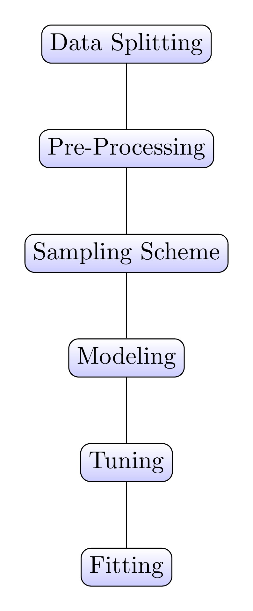
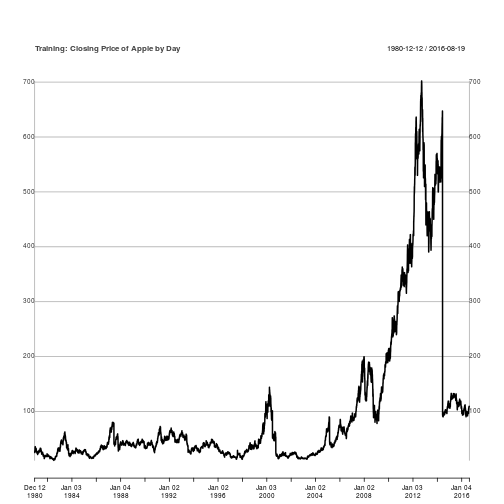
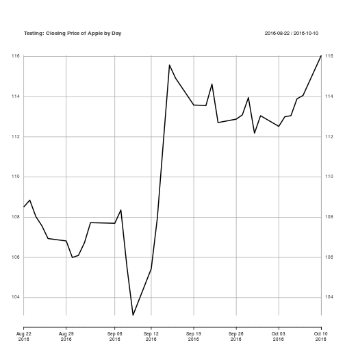
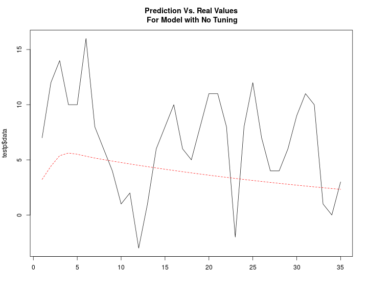
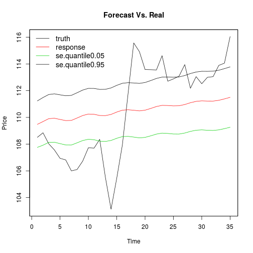
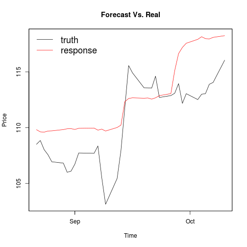

Forecasting in the MLR Framework
========================================================
author: Steve Bronder
date: October 11th, 2016
autosize: true

What is Forecasting?
========================================================

- Predictions of future based on past trends
- What happens Vs. What happens tomorrow
- Stocks, earthquakes, neuroscience

Goal: Make Forecasting Simple
========================================================

> "We need to stop teaching abstinence and start teaching safe statistics"
- Hadley Wickham

Ex: Demeaning the whole data set before CV

- Problem: Forecasting can be dangerous
- Insight: Need a framework for 'safe forecasting'
- Solution: Use ML Framework in forecasting

The Modeling Process
========================================================



***

- MLR automates this pipeline
- Make forecasting safer by using the pipeline

Example Data
======================================================


```r
library(Quandl)
library(xts)
aapl <- Quandl("YAHOO/AAPL", api_key="UG7wmFCm6zMyq1xhW9Re")
aaplXts <- xts(aapl$Close, order.by = as.POSIXlt(aapl$Date))
colnames(aaplXts) <- "Close"
aaplXtsTrain <- aaplXts[1:9000,]
aaplXtsTest  <- aaplXts[9001:9035,]
```

Plot of aapl Stock
=====================================================




***




Creating a Forecasting Task
========================================================

- Task: Keeps data and meta-data for ML task


```r
library(mlr)
aaplTask <- makeForecastRegrTask(
  id = "Forecast aapl Closing Price",
  data = aaplXtsTrain,
  target  = "Close",
  frequency = 5L)
```

Creating a Forecasting Task: Info
========================================================

```r
aaplTask
```

```
Task: Forecast aapl Closing Price
Type: fcregr
Target: Close
Observations: 9000
Dates:
 Start: 1980-12-12 
 End:   2016-08-19
Frequency: 7
Features:
numerics  factors  ordered 
       0        0        0 
Missings: FALSE
Has weights: FALSE
Has blocking: FALSE
```


Making a Forecasting Learner
======================================================


```r
garch.mod =makeLearner("fcregr.garch", 
                      model = "sGARCH",
                      garchOrder = c(5,5),
                      distribution.model = "sged",
                      armaOrder = c(6,6),
                      n.ahead = 35,
                      predict.type = "quantile")
```

Making a Forecasting Learner
======================================================


```r
garch.mod 
```

```
Learner fcregr.garch from package rugarch
Type: fcregr
Name: Generalized AutoRegressive Conditional Heteroskedasticity; Short name: garch
Class: fcregr.garch
Properties: numerics,quantile
Predict-Type: quantile
Hyperparameters: model=sGARCH,garchOrder=5,5,distribution.model=sged,armaOrder=6,6,n.ahead=35
```

Train a Forecast Learner
======================================================


```r
garch.train <- train(garch.mod, aaplTask)
garch.train
```

```
Model for learner.id=fcregr.garch; learner.class=fcregr.garch
Trained on: task.id = Forecast aapl Closing Price; obs = 9000; features = 0
Hyperparameters: model=sGARCH,garchOrder=5,5,distribution.model=sged,armaOrder=6,6,n.ahead=35
```

Predict With a Forecast Learner
======================================================

```r
predAapl <- predict(garch.train, newdata = as.data.frame(aaplXtsTest))
performance(predAapl, measures = mase, task = aaplTask)
```

```
   mase 
0.72276 
```

Prediction Plot
=====================================================




Tuning a Model
=====================================================


```r
# Make a tuning grid for GARCH
par_set = makeParamSet(
  makeDiscreteParam(id = "model",
                    values = c("sGARCH", "csGARCH", "fGARCH")),
  makeDiscreteParam("submodel", values = c("GARCH","TGARCH","AVGARCH"),requires = quote(model == 'fGARCH') ),
  makeIntegerVectorParam(id = "garchOrder", len = 2L,
                         lower = 1, upper = 8),
  makeIntegerVectorParam(id = "armaOrder", len = 2L,
                         lower = 1, upper = 9),
  makeLogicalParam(id = "include.mean"),
  makeLogicalParam(id = "archm"),
  makeDiscreteParam(id = "distribution.model",
                    values = c("norm","std","jsu", "sged")),
  makeDiscreteParam(id = "stationarity", c(0,1)),
  makeDiscreteParam(id = "fixed.se", c(0,1))
)
```

Making a Resample Scheme
========================================


```r
resampDesc = makeResampleDesc("GrowingCV", horizon = 35L,
                              initial.window = .9,
                              size = nrow(getTaskData(aaplTask)),
                              skip = .01)
resampDesc
```

```
Window description:
 growing with 10 iterations:
 8100 observations in initial window and 35 horizon.
Predict: test
Stratification: FALSE
```

Example of Windowing Resample
======================================================
<center>

</center>

Making a Tuning Control
===========================================


```r
ctrl <- makeTuneControlIrace(maxExperiments = 350)
```

Tuning Over Parameter Space
===========================================


```r
garch.mod = makeLearner("fcregr.garch", n.ahead = 35, solver = 'hybrid')
library("parallelMap")
parallelStart("multicore",3)
configureMlr(on.learner.error = "warn")
set.seed(1234)
garch.res = tuneParams(garch.mod, task = aaplTask,
                 resampling = resampDesc, par.set = par_set,
                 control = ctrl,
                 measures = mase)
parallelStop()
garch.res
```


```
Tune result:
Op. pars: model=sGARCH; garchOrder=1,2; armaOrder=5,4; include.mean=FALSE; archm=FALSE; distribution.model=sged; stationarity=1; fixed.se=0
mase.test.mean=5.58
```

Tuning Over Parameter Space: Final Model
===========================================


```r
library(mlr)
garch.final = setHyperPars(makeLearner("fcregr.garch", n.ahead = 35, solver = 'nloptr',
                                       solver.control = list(maxeval = 200000, solver = 10),
                                       predict.type = "quantile"),par.vals = garch.res$x)

garch.train = train(garch.final, aaplTask)
garch.pred = predict(garch.train, newdata = aaplXtsTest)
performance(garch.pred, measures = mase, task = aaplTask)
```

```
     mase 
0.6784888 
```

Tuning Over Parameter Space: Plot Forecast
===========================================




Using an ML Model
=========================================


```r
aaplRegTask <- makeRegrTask(
  id = "Forecast aapl Closing Price",
  data = as.data.frame(aaplXtsTrain,rownames = index(aaplXtsTrain)),
  target  = "Close")

aaplLagTask = createLagDiffFeatures(aaplRegTask, lag = 1L:600L, difference = 0L, na.pad = FALSE)
```

Using an ML Model
=========================================


```r
resampDesc = makeResampleDesc("GrowingCV", horizon = 35L,
                              initial.window = .9,
                              size = nrow(getTaskData(aaplLagTask)),
                              skip = .01)
resampDesc
```

```
Window description:
 growing with 10 iterations:
 7560 observations in initial window and 35 horizon.
Predict: test
Stratification: FALSE
```

Using an ML Model
=========================================


```r
## Trying Support Vector Machines
xg_learner <- makeLearner("regr.xgboost", booster = "gbtree", nthread = 4)
getLearnerParamSet("regr.xgboost")
xg_param_set <- makeParamSet(
  makeNumericParam(id = "eta", lower = 0.1, upper = 1),
  makeNumericParam(id = "gamma", lower = 0, upper = 100),
  makeNumericParam(id = "lambda", lower = 0, upper = 100),
  makeNumericParam(id = "lambda_bias", lower = 0, upper = 100),
  makeNumericParam(id = "alpha", lower = 0, upper = 100),
    makeNumericParam(id = "base_score", lower = 80, upper = 120),
  makeNumericParam(id = "colsample_bytree", lower = 0.01, upper = 1),
  makeNumericParam(id = "colsample_bylevel", lower = 0.01, upper = 1),
    makeNumericParam(id = "subsample", lower = 0.01, upper = 1),
  makeIntegerParam(id = "max_depth",  lower = 5, upper = 1000),
  makeIntegerParam(id = "nrounds", lower = 5, upper = 1000),
  makeIntegerParam(id = "num_parallel_tree", lower = 1, upper = 10)
)
```

Using an ML Model
=========================================


```r
ctrl <- makeTuneControlIrace(maxExperiments = 400)

library("parallelMap")
parallelStart("socket",2, level = "mlr.resample")
configureMlr(on.learner.error = "warn")
tune_mod <- tuneParams(learner = xg_learner, task = aaplLagTask,
                       measures = mase, resampling = resampDesc,
                       par.set = xg_param_set, control = ctrl )
parallelStop()
tune_mod
```


```
Tune result:
Op. pars: eta=0.355; gamma=56.7; lambda=91.2; lambda_bias=76.2; alpha=34.7; base_score=82.8; colsample_bytree=0.951; colsample_bylevel=0.778; subsample=0.27; max_depth=432; nrounds=360; num_parallel_tree=6
mase.test.mean=4.59
```

Using an ML Model
=========================================


```r
xg_learner <- makeLearner("regr.xgboost", booster = "gbtree", nthread = 7)
gbm_final = setHyperPars(xg_learner, par.vals = tune_mod$x)
gbm_train <- train(gbm_final, aaplLagTask)
```


Using an ML Model
=========================================


```r
gbm_fore = forecast(gbm_train, h = 35, newdata = aaplXtsTest)
performance(gbm_fore, mase, task = aaplLagTask)
```

```
    mase 
1.590896 
```


Using an ML Model
=========================================





