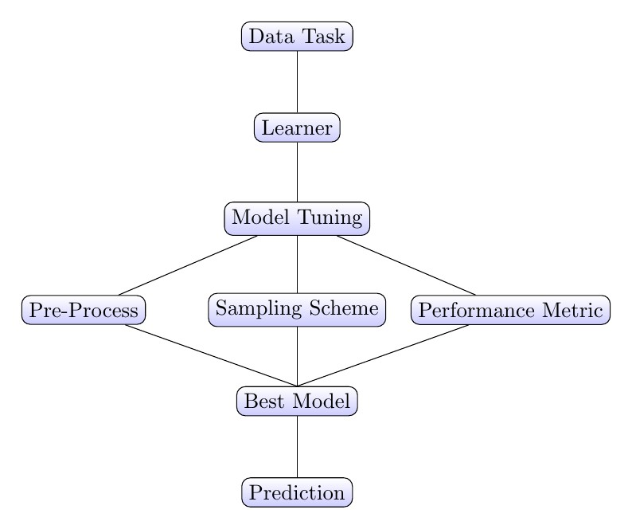
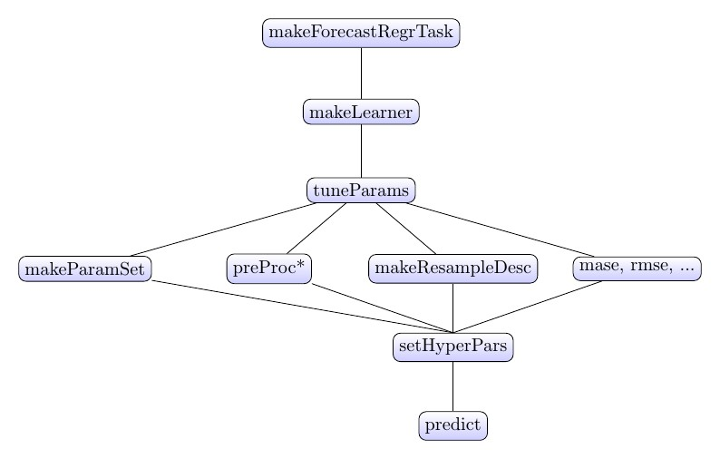
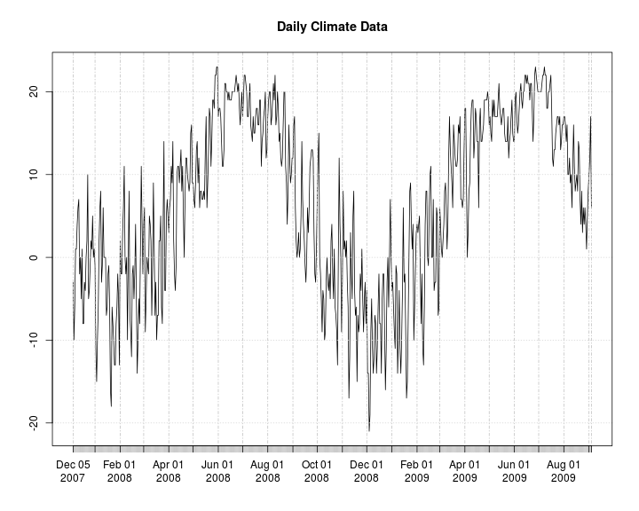
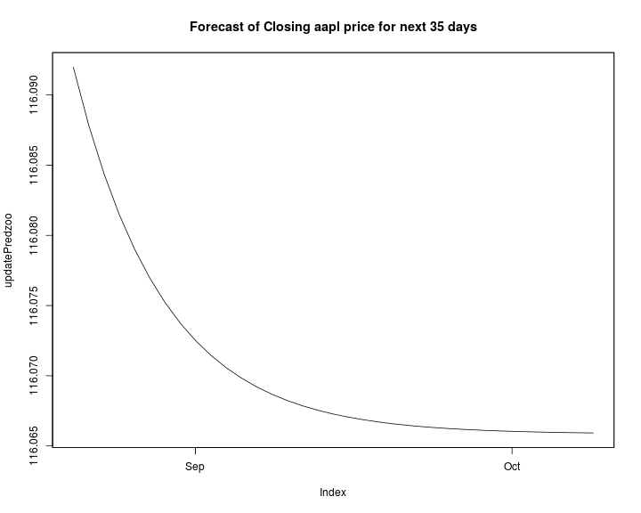

Forecasting in the MLR Framework
========================================================
author: Steve Bronder
date: October 11th, 2016
autosize: true

Goal: Make Forecasting Simple
========================================================

> "We need to stop teaching abstinence and start teaching safe statistics"
- Hadley Wickham

Ex: Demeaning the whole data set before CV

- Forecasting is very dangerous
- Need a framework for 'safe forecasting'
- Want to use ML in forecasting

The Modeling Process
========================================================



***



Example Data
======================================================

```r
library(Quandl)
library(xts)
aapl <- Quandl("YAHOO/AAPL", api_key="UG7wmFCm6zMyq1xhW9Re")
aaplXts <- xts(aapl$Close, order.by = as.POSIXlt(aapl$Date))
colnames(aaplXts) <- "Close"
aaplXtsTrain <- aaplXts[1:9000,]
aaplXtsTest  <- aaplXts[9001:9035,]
```

Plot of aapl Stock
=====================================================


```r
plot(aaplXtsTrain, main = "Closing Price of Apple by Day")
```



Creating a Forecasting Task
========================================================


```r
library(mlr)
aaplTask <- makeForecastRegrTask(id = "aapl",data = aaplXtsTrain,target  = "Close",frequency = 7L)
aaplTask
```

```
Task: aapl
Type: regr
Observations: 9000
Dates:
 Start: 1980-12-11 19:00:00 
 End: 2016-08-18 20:00:00
Frequency: 7
Features:
numerics  factors  ordered 
       1        0        0 
Missings: FALSE
Has weights: FALSE
Has blocking: FALSE
```

Making a Forecasting Learner
======================================================


```r
arm <- makeLearner("fcregr.Arima", order = c(13L,1L,13L), h = 35L, include.mean = TRUE)
arm
```

```
Learner fcregr.Arima from package forecast
Type: regr
Name: AutoRegressive Integrated Moving Average; Short name: Arima
Class: fcregr.Arima
Properties: numerics,ts,se
Predict-Type: response
Hyperparameters: order=13,1,13,h=35,include.mean=TRUE
```

Train a Forecast Learner
======================================================


```r
trainArima <- train(arm, aaplTask)
trainArima
```

```
Model for learner.id=fcregr.Arima; learner.class=fcregr.Arima
Trained on: task.id = aapl; obs = 9000; features = 1
Hyperparameters: order=13,1,13,h=35,include.mean=TRUE
```

Predict With a Forecast Learner
======================================================

```r
predAapl <- predict(trainArima, newdata = aaplXtsTest)
performance(predAapl, measures = mase, task = aaplTask)
```

```
      mase 
0.00934123 
```

Prediction Plot
=====================================================


Update Model
=====================================================


```r
armUpdate  = updateModel(trainArima, aaplTask, newdata = aaplXtsTest)
updatePred = predict(armUpdate, newdata = data.frame(None = rep(NA,35), row.names = index(aaplXtsTest)+ days(50) ))
```

Updated Forecast
=====================================================


Tuning a Model
=====================================================


```r
parSet = makeParamSet(
  makeIntegerVectorParam(id = "order",
                         len = 3L,
                         lower = c(10L,0L,10L),
                         upper = c(15,1,15),
                         tunable = TRUE),
  makeIntegerVectorParam(id = "seasonal",
                         len = 3,
                         lower = c(0,0,0),
                         upper = c(1,1,1),
                         tunable = TRUE),
  makeLogicalParam(id = "include.mean",
                   default = FALSE,
                   tunable = TRUE),
  makeLogicalParam(id = "include.drift",
                   default = FALSE,
                   tunable = TRUE),
  makeNumericParam(id = "h",
                   default = 35,
                   tunable = FALSE,
                   lower = 35,
                   upper = 35)
)

#Specify tune by grid estimation
ctrl = makeTuneControlRandom()
```

Making a Resample Scheme
========================================


```r
resampDesc = makeResampleDesc("GrowingCV", horizon = 35L,
                               initialWindow = 7000L,
                               size = nrow(getTaskData(aaplTask)), skip = 35L)
resampDesc
```

```
Window description:
 growing with 55 iterations:
 7000 observations in initial window and 35 horizon.
Predict: test
Stratification: FALSE
```

Example of Windowing Resample
======================================================
<center>

</center>

Tuning Over Parameter Space
===========================================


```r
library("parallelMap")
parallelStartSocket(6)
configureMlr(on.learner.error = "warn")
set.seed(1234)
res = tuneParams("fcregr.Arima", task = Fin.task1, resampling = resampDesc,
                 par.set = parSet, control = ctrl, measures = mase)
parallelStop()
```


Using an ML Model
=========================================


```r
aaplLagDat = createLagDiffFeatures(aaplXts, lag = 35L:100L, na.pad = FALSE, return.nonlag = TRUE)
aaplLagTrain = aaplLagDat[1:I(nrow(aaplLagDat) - 35L),]
aaplLagTest = aaplLagDat[I(nrow(aaplLagDat) - 35L):nrow(aaplLagDat),]
aaplLagTask = makeForecastRegrTask(id = "gbmAapl", data = aaplLagTrain, target = "Close")
aaplLagTask$env$data <- aaplLagTask$env$data[,-1]
regrGbm = makeLearner("regr.gbm", par.vals = list(n.trees = 2000,interaction.depth = 8, distribution = "laplace"))
gbmMod  = train(regrGbm, aaplLagTask)
```

Make Resampling Scheme
===========================================


```r
resampDesc = makeResampleDesc("GrowingCV", horizon = 35L,
                               initialWindow = 7000L,
                               size = nrow(getTaskData(aaplLagTask)), skip = 35L)
```

Make Tuning Set and Search Scheme
===========================================

```r
library(mlr)
ps = makeParamSet(
  makeDiscreteParam("distribution", values = c("gaussian","laplace", "tdist")),
  makeIntegerParam("n.trees", lower = 1, upper = 10, trafo = function(x) x * 1000),
  makeIntegerParam("interaction.depth", lower = 1, upper = 5, trafo = function(x) x * 5),
  makeNumericParam("shrinkage", lower = 1E-5, upper = 1E-2)
)
ctrl = makeTuneControlIrace(maxExperiments = 200L)
```
Tuning GBM Model
===========================================


```
Error in UseMethod("instantiateResampleInstance") : 
  no applicable method for 'instantiateResampleInstance' applied to an object of class "c('GrowingCVDesc', 'ResampleDesc')"
```
