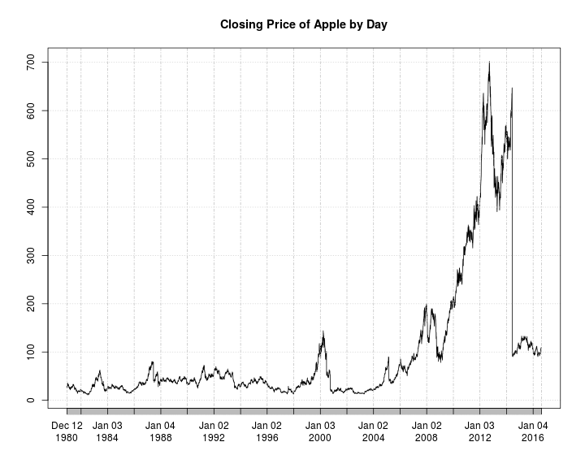
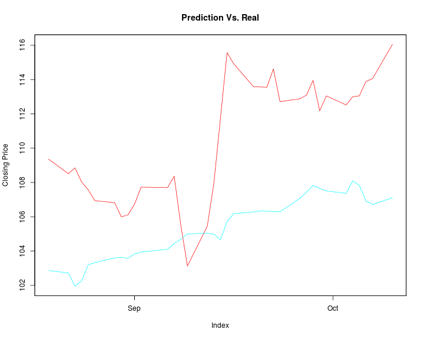

Forecasting in the MLR Framework
========================================================
author: Steve Bronder
date: October 11th, 2016
autosize: false

<style>
.small-code pre code {
  font-size: 1em;
}
</style>

Goal: Make Forecasting Simple
========================================================

> "We need to stop teaching abstinence and start teaching safe statistics"
- Hadley Wickham

Ex: Demeaning the whole data set before CV

- Forecasting is very dangerous
- Need a framework for 'safe forecasting'
- Want to use ML in forecasting

The Modeling Process
========================================================


***


Example Data
======================================================
class: small-code 


```r
library(M4comp)
library(xts)
library(lubridate)
m4Fin1 <- M4[[8836]]
m4Train1 <- xts(m4Fin1$past, as.POSIXct("2007-12-05") + days(0:I(length(m4Fin1$past)-1)))
m4Test1 <- xts(m4Fin1$future, as.POSIXct("2009-09-06") + days(0:I(length(m4Fin1$future)-1)))
colnames(m4Train1) <- "target_var"
colnames(m4Test1) <- "target_var"
```

Plot of Climate Data
=====================================================
class: small-code 



Creating a Forecasting Task
========================================================
class: small-code 


```r
library(mlr)
climate.task = makeForecastRegrTask(id = "M4 Climate Data",data = m4Train1,
                                    target = "target_var",frequency = 365L)
climate.task
```

```
Task: M4 Climate Data
Type: fcregr
Observations: 640
Dates:
 Start: 2007-12-05 
 End: 2009-09-04
Frequency: 365
Features:
numerics  factors  ordered 
       1        0        0 
Missings: FALSE
Has weights: FALSE
Has blocking: FALSE
```

Making a Forecasting Learner
======================================================
class: small-code 


```r
tbatsMod =makeLearner("fcregr.tbats",
                      use.box.cox = FALSE,
                      use.trend = TRUE,
                      seasonal.periods = TRUE,
                      max.p = 3, max.q = 2,
                      stationary = FALSE,
                      use.arma.errors = TRUE, h = 35)
tbatsMod
```

```
Learner fcregr.tbats from package forecast
Type: fcregr
Name: Exponential smoothing state space model with Box-Cox transformation,
    ARMA errors, Trend and Seasonal Fourier components; Short name: tbats
Class: fcregr.tbats
Properties: numerics,ts,quantile
Predict-Type: response
Hyperparameters: use.box.cox=FALSE,use.trend=TRUE,seasonal.periods=TRUE,max.p=3,max.q=2,stationary=FALSE,use.arma.errors=TRUE,h=35
```

Train a Forecast Learner
======================================================
class: small-code 


```r
trainTbats= train(tbatsMod, climate.task )
trainTbats
```

```
Model for learner.id=fcregr.tbats; learner.class=fcregr.tbats
Trained on: task.id = M4 Climate Data; obs = 640; features = 1
Hyperparameters: use.box.cox=FALSE,use.trend=TRUE,seasonal.periods=TRUE,max.p=3,max.q=2,stationary=FALSE,use.arma.errors=TRUE,h=35
```

Predict With a Forecast Learner
======================================================
class: small-code 


```r
testp = predict(trainTbats, newdata = m4Test1)
performance(testp, mase, task = climate.task)
```

```
     mase 
0.0676601 
```

```r
mase
```

```
Name: Mean Absolute Scaled Error
Performance measure: mase
Properties: regr,fcregr,req.pred,req.truth,req.task
Minimize: TRUE
Best: 0; Worst: Inf
Aggregated by: test.mean
Note: 
```

Prediction Plot
=====================================================
class: small-code 


Tuning a Model
=====================================================
class: small-code 


```r
parSet = makeParamSet(
  makeLogicalParam(id = "use.box.cox", default = FALSE, tunable = TRUE),
  makeLogicalParam(id = "use.trend", default = FALSE, tunable = TRUE),
  makeLogicalParam(id = "use.damped.trend", default = FALSE, tunable = TRUE),
  makeLogicalParam(id = "seasonal.periods", default = FALSE, tunable = TRUE),
  makeIntegerParam(id = "max.p", upper = 20, lower = 0),
  makeIntegerParam(id = "start.p", upper = 10, lower = 1, 
                   trafo = function(x) x*2),
  makeIntegerParam(id = "max.q", upper = 20, lower = 0),
  makeIntegerParam(id = "start.q", upper = 10,lower = 1,
                   trafo = function(x) x*2),
  makeIntegerParam("max.P", lower = 0, upper = 5),
  makeIntegerParam("max.Q", lower = 0, upper = 5),
  makeDiscreteParam("ic", values = c("aicc","aic","bic")),
  makeDiscreteParam("test", values = c("kpss","adf","pp")),
  makeDiscreteParam("seasonal.test", values = c("ocsb", "ch")),
  makeLogicalParam("biasadj", default = FALSE)
  )
```


Make a Tune Control Scheme
=====================================================
class: small-code 


```r
#Specify tune by grid estimation
ctrl = makeTuneControlIrace(maxExperiments = 500L)
ctrl
```

```
Tune control: TuneControlIrace
Same resampling instance: FALSE
Imputation value: <worst>
Start: NULL

Tune threshold: FALSE
Further arguments: n.instances=100, show.irace.output=FALSE, maxExperiments=500
```

Making a Resample Scheme
========================================
class: small-code 


```r
resampDesc = makeResampleDesc("GrowingCV", horizon = 35L,
                               initial.window = 400L,
                               size = nrow(getTaskData(climate.task)), skip = 6L)
resampDesc
```

```
Window description:
 growing with 30 iterations:
 400 observations in initial window and 35 horizon.
Predict: test
Stratification: FALSE
```

Example of Windowing Resample
======================================================
<center>

</center>

Tuning Over Parameter Space
===========================================
class: small-code 


```r
library("parallelMap")
parallelStartSocket(6)
tbatsTune = tuneParams(makeLearner("fcregr.tbats",h = 35), 
                       task = climate.task,
                       resampling = resampDesc,
                       par.set = parSet,
                       control = ctrl,
                       measures = mase)
parallelStop()
tbatsTune
```


```
Tune result:
Op. pars: use.box.cox=TRUE; use.trend=TRUE; use.damped.trend=TRUE; seasonal.periods=FALSE; max.p=7; start.p=8; max.q=2; start.q=8; max.P=2; max.Q=1; ic=aicc; test=kpss; seasonal.test=ocsb; biasadj=FALSE; h=35
mase.test.mean=0.0688
```


Training Best Model
=========================================
class: small-code 


```r
lrn = setHyperPars(makeLearner("fcregr.tbats"), par.vals = tbatsTune$x)
m = train(lrn, climate.task)
m
```

```
Model for learner.id=fcregr.tbats; learner.class=fcregr.tbats
Trained on: task.id = M4 Climate Data; obs = 640; features = 1
Hyperparameters: use.box.cox=TRUE,use.trend=TRUE,use.damped.trend=TRUE,seasonal.periods=FALSE,max.p=7,start.p=8,max.q=2,start.q=8,max.P=2,max.Q=1,ic=aicc,test=kpss,seasonal.test=ocsb,biasadj=FALSE,h=35
```

Prediction With Best Model
=========================================
class: small-code 


```r
climate.pred = predict(m, newdata = m4Test1)
performance(climate.pred, measures = mase, task = climate.task)
```

```
      mase 
0.06145902 
```

Prediction Plot With Best Model
=========================================
class: small-code 


Using an ML Model: Making Lagged Tasks
=========================================
class: small-code 


```r
climateLagTask = createLagDiffFeatures(climate.task, lag = 35L:100L, na.pad = FALSE, return.nonlag = TRUE)
climateLagTask$env$data <- climateLagTask$env$data[,-1]
climateLagTask$task.desc$type <- "regr"
climateLagTask
```

```
Task: M4 Climate Data
Type: regr
Observations: 540
Dates:
 Start: 2008-03-14 
 End: 2009-09-04
Frequency: 365
Features:
numerics  factors  ordered 
      67        0        0 
Missings: FALSE
Has weights: FALSE
Has blocking: FALSE
```

Using an ML Model: Making Lagged Tasks
=========================================
class: small-code 


```r
regrGbm = makeLearner("regr.gbm",
                      par.vals = list(n.trees = 2000,
                                      interaction.depth = 8,
                                      distribution = "laplace"))
gbmMod = train(regrGbm, climateLagTask)
```

Make Resampling Scheme
===========================================
class: small-code 


```r
resampDesc = makeResampleDesc("GrowingCV", horizon = 35L,
                               initial.window = 300L,
                               size = nrow(getTaskData(climateLagTask)),
                               skip = 6L)
resampDesc
```

```
Window description:
 growing with 30 iterations:
 300 observations in initial window and 35 horizon.
Predict: test
Stratification: FALSE
```

Make Tuning Set and Search Scheme
===========================================
class: small-code 


```r
ps = makeParamSet(
  makeDiscreteParam("distribution", values = c("laplace", "tdist")),
  #
  makeIntegerParam("n.trees",lower = 1, upper = 3,
                   trafo = function(x) x * 100),
  #
  makeIntegerParam("interaction.depth", lower = 1, upper = 3,
                   trafo = function(x) x * 5),
  #
  makeNumericParam("shrinkage", lower = 1, upper = 2)
)
ctrl = makeTuneControlIrace(maxExperiments = 300L)
```

Tuning GBM Model
===========================================
class: small-code 


```r
library("parallelMap")
parallelStartSocket(6)
configureMlr(on.learner.error = "warn")
set.seed(1234)
res = tuneParams("regr.gbm", task = climateLagTask,
                 resampling = resampDesc,
                 par.set = ps, control = ctrl,
                 measures = mase)
parallelStop()
res
```


```
Tune result:
Op. pars: distribution=laplace; n.trees=100; interaction.depth=15; shrinkage=1
mase.test.mean=0.205
```


Tuning GBM Model
===========================================
class: small-code 


```r
lrn = setHyperPars(makeLearner("regr.gbm"), par.vals = res$x)
m = train(lrn, climateLagTask)
m
```

```
Model for learner.id=regr.gbm; learner.class=regr.gbm
Trained on: task.id = M4 Climate Data; obs = 540; features = 66
Hyperparameters: distribution=laplace,keep.data=FALSE,n.trees=100,interaction.depth=15,shrinkage=1
```
Forecast with ML Model
======================================================
class: small-code 


```r
m4Full <- rbind(m4Train1,m4Test1)
climateLagData = createLagDiffFeatures(m4Full, lag = 35L:100L,
                                       na.pad = FALSE,
                                       return.nonlag = TRUE)
climateLagTest = climateLagData[I(nrow(climateLagData) - 
                                    35):I(nrow(climateLagData)),]
testp <- predict(gbmMod, newdata = climateLagTest)
performance(testp, mase, climateLagTask)
```

```
      mase 
0.09439998 
```

Plot Forecast
===========================================
class: small-code 


